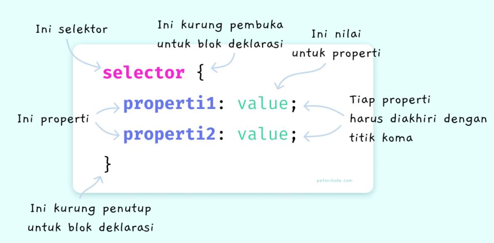

## CSS (Cascade Style Sheet)

CSS (Cascade Style Sheet) adalah sebuah bahasa untuk mengatur tampilan web sehingga terlihat lebih menarik dan indah. Dengan CSS, kita dapat mengatur layout (tata letak), warna, font, garis, background, animasi, dan lain-lain. Berikut contoh tampilan css :

## Struktur Dasar CSS

Struktur kode CSS terdiri dari tiga bagian, yaitu Selektor, Blok Deklarasi,  Properti dan nilainya. Format penulisannya seperti ini:

### Selektor
Selektor adalah kata kunci untuk memilih elemen HTML yang akan kita beri style. Selektor dapat berupa nama tag, class, id, dan atribut. Contohnya :

    /* Selektor dengan nama tag */
    h2 {
        color: blue
    }

    /* Selektor dengan class */
    .bg-yellow {
        background-color: yellow;
    }

    /* selektor dengan ID elemen */
    #header {
        background: grey;
    }

    /* Selektor dengan Atribut */
    input[type=text]{
        background: yellow;
    }

### Blok Deklarasi
Blok deklarasi adalah tempat kita menuliskan atribut atau properti CSS yang akan diberikan ke pada elemen yang telah diseleksi. Blok deklarasi dimulai atau dibuka dengan tanda kurung `{` lalu ditutup dengan `}` . Satu blok deklarasi, bisa dipakai oleh lebih dari satu selektor.

Contohnya :

    h1, h2, h3, h4, h5, h6 {
        color: teal;
    }

### Properti dan Nilainya
Properti adalah sekumpulan aturan yang akan diberikan kepada elemen yang dipilih. Format penulisan properti seperti ini :

    properti: "nilai";

Setiap properti harus diakhiri dengan titik koma `;`. Apabila hanya terdapat satu properti, boleh tidak menggunakan titik koma. Properti harus ditulis di dalam blok deklarasi. Contoh : 

    blockquote {
        background: pink;
    }

    // nilai berupa teks
    font-family: "Times new roman";

    // nilai lebih dari satu
    font-family: "Times new roman", Georgia, Roboto;

For full explanation visit [css_introduction](https://www.petanikode.com/css-sintaks/)
